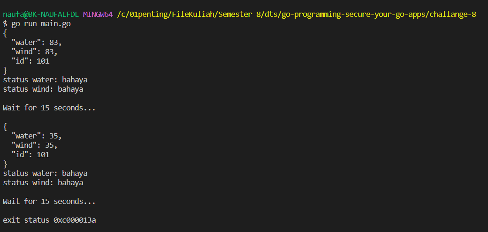

# Challange 8 (chapter 3 sesi 1)

The program will generate post every 15 second with random number of water and wind range of 1 - 100.

How to run program:
    `go run main.go`

How to stop program:
    ctrl + c

**Output program**
